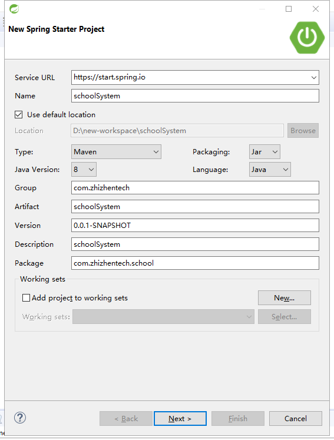
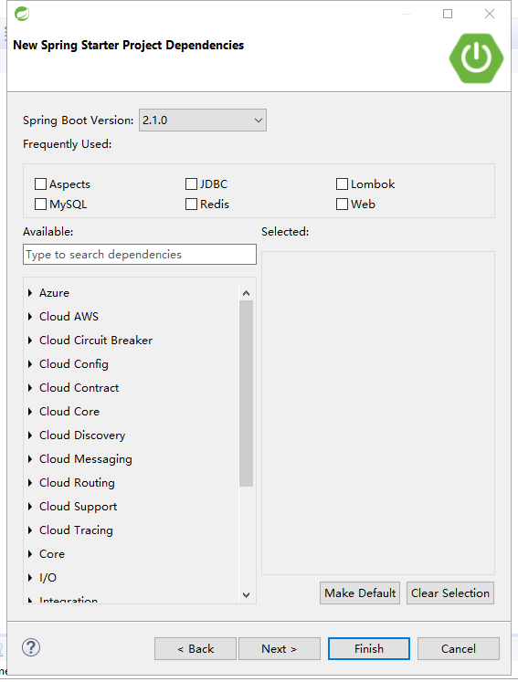

### 前言

Spring Boot是由Pivotal团队提供的全新框架，其设计目的是用来简化新Spring应用的初始搭建以及开发过程。该框架使用了特定的方式来进行配置，从而使开发人员不再需要定义样板化的配置。通过这种方式，Spring Boot致力于在蓬勃发展的快速应用开发领域(rapid application development)成为领导者。 

特点:
1. 创建独立的Spring应用程序
2. 嵌入的Tomcat，无需部署WAR文件
3. 简化Maven配置
4. 自动配置Spring
5. 提供生产就绪型功能，如指标，健康检查和外部配置
6. 绝对没有代码生成并且对XML也没有配置要求 [1]

##### 1. 项目准备
开发工具 spring tools suite  
https://spring.io/tools  
JDK 1.8 版本  
https://www.oracle.com/technetwork/java/javase/downloads/jdk8-downloads-2133151.html  
Maven库管理工具 
http://maven.apache.org/  
Mysql数据库  
https://dev.mysql.com/downloads/  

##### 2. 软件安装及配置
eclipse 简单配置  
eclipse 全配置  

##### 3. 创建项目

1. eclipse 菜单栏中 File => New => Spring Stater Project   

2. 点击Next >  
指定Spring Boot 版本，此Demo使用的是2.1.0，选择插件，此Demo选择了 Aspects 切面，JDBC Spring的事务管理， Lombok 简化get set 方法, MySql 驱动 ，Redis 缓存(暂时没用,但是也添加上了) , Web SpringMVC web支持. 最后Finish 就完成了.

#### 4. 新建数据库脚本
文件请见 
[数据库文件](../database/db_zhizhentech_arsystem.sql)

#### 5. 配置项目的pom.xml文件，依赖含义(没有的添加上).
|  groupId        |  artifactId  |  version  | 作用  | 其他 |
| :----:   | :----:  | :----:  |
| org.springframework.boot     |   spring-boot-starter-data-redis |   -     |     redis自动配置包    | -|
| org.springframework.boot        |   spring-boot-starter-jdbc   |    |spring jdbc 事务管理 |-|
| org.springframework.boot       |    spring-boot-starter-web    | - | spring mvc 框架及自动配置 |-|
| org.springframework.boot    | spring-boot-starter-test | - | spring test 支持| scope test|
| org.springframework.boot | spring-boot-configuration-processor | - | 可使用再在你的配置类开头加上@PropertySource("classpath:your.properties")，其余用法与加载yml的配置一样 |optional true|
| org.springframework.boot | spring-boot-devtools | - | 热部署 | optional true|
| mysql | mysql-connector-java | - | mysql 驱动 | scope runtime |
| org.projectlombok | lombok | - | 省略get set 方法| scope provided |
| com.alibaba | druid | 1.0.26 | 数据库连接池 |
| com.baomidou | mybatis-plus-boot-starter | 3.0.5 | CURD 框架
| org.freemarker | freemarker | - | 用于自动生成mapper等
| com.alibaba | fastjson | 1.2.47 | 转JSON字符串
| org.jodd | jodd-core | 3.4.8 | 用于时间的java类

#### 6. 配置spring boot 的maven插件
groupId org.springframework.boot  
artifactId spring-boot-maven-plugin  

#### 7. 配置spring boot 的配置文件
删除 src/main/resources 文件夹下的 application.properties 文件,并且新建application.yml 文件.
1. 配置内置tomcat的端口  
server: port: 8080
2. 配置jdbc连接池  
spring:
  datasource:
    name: druidDataSource
    username: root
    password: sa123
    driver-class-name: com.mysql.jdbc.Driver
    type: com.alibaba.druid.pool.DruidDataSource
    url: jdbc:mysql://localhost:3306/db_zhizhentech_ar?characterEncoding=utf8&useSSL=false
3. 配置静态资源的访问  
resources:
  static-locations:
  - classpath:/META-INF/resources/
  - classpath:/resources/
  - classpath:/static/
  - classpath:/public/
   
mvc:
  static-path-pattern: /**
4. 配置mybatis-plus   
mybatis-plus:
  configuration:
    map-underscore-to-camel-case: true
  mapper-locations:
  - classpath:mybatis/*.xml
5. 配置打印sql  
logging:
  level:
     org.springframework: warn
     com.zhizhentech.schoolsystem.mapper: trace

#### 8. 使用自动生成工具，生成mybatis plus 的 各个层级代码 (entity, dao , service ,serviceImpl . controller)
生成工具  
http://mp.baomidou.com/guide/generator.html#%E6%B7%BB%E5%8A%A0%E4%BE%9D%E8%B5%96  
生成工具使用方法 见 mybatis plus 详解

#### 9. mybatis plus的配置
在ArApplication 中添加 
@MapperScan("com.zhizhentech.ar.mapper")
 
再添加一个分页Bean

	@Bean
	  public PaginationInterceptor paginationInterceptor() {
	      PaginationInterceptor page = new PaginationInterceptor();
	      page.setDialectType("mysql");
	      return page;
	  }
